# QRogue v0.8.1 #

<p align="center">

</p>


## Table of Contents ##
- About the Game
  - Game World
  - Quantum Puzzles
- Feedback
- Installation
  - Dependencies
  - Linux/macOS
  - Windows
  - Notes
- Playing the Game
  - Terminal
  - Launch Options
  - Controls
  - Difficulty Modes
  - Main Menu
  - Screen check
  - Pause Menu
- Mathematical Background
  - Quantum Bits
  - Quantum Operations
  - Applying Operations in series
  - Working with multiple Qubits
  - Applying Operations in parallel
- References


## About the Game: A Journey through a Universe full of Quantum Computing!

QRogue is an educational game about Quantum Computing, inspired in look and feel by the 1980s released classical game <a href="https://en.wikipedia.org/wiki/Rogue_%28video_game%29">Rogue</a>. You will play as a student who's dreaming about traveling the galaxy. As you hear about "Mission Quniverse", you immediately apply for its training program to be able to join this fascinating Quantum Computing powered universe exploration mission. In the lessons of the training program and later on during expeditions of Mission Quniverse you will come across a variety of quantum gates. Your Qubot - a robot you control to manipulate quantum circuits - will be able to use them to steadily increase its capabilities and even design small scale quantum algorithms at some point.

But beware of ill-disposed Decoherers - or *Deqos* for short! They got their name from Decoherence, a phenomenon of the quantum realm that describes how interactions with the environment can destroy a quantum state and turn it classical. And these Deqos will do their best to stand in your way. But luckily, they are in *Superposition* and your Qubot is equipped with a *Measurement* ability. This means, you can collapse their quantum state to 0 or 1 by moving towards them. Depending on the result, they will either manifest and block your path until you solve their quantum puzzle, or vanish without a trace.
Be ready to combine various quantum gates into all kinds of quantum circuits should you be challenged to solve a puzzle. And some Deqos will be *entangled*, forming a group that collectively collapses to the same classical state upon measurement. 

### Game World ###

The game world of QRogue consists of multiple elements described in Fig. 1.
 
<figure id="qrogue_lvl-fig">
  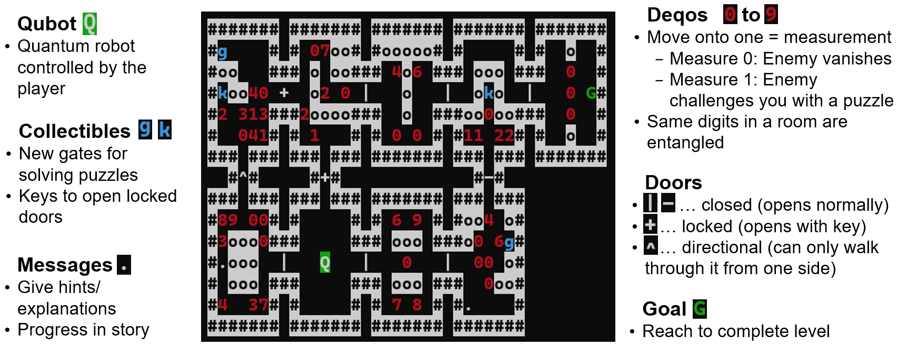
  <figcaption style="text-align: center;">Figure 1: Screenshot of QRogue's game world with descriptions of what you can see in a typical level.</figcaption>
</figure>

### Quantum Puzzles ###

Progress in QRogue is achieved by solving Quantum Puzzles. 
They consist of a given Input State Vector and Target State Vector. 
Your goal is to place Quantum Gates in your Quantum Circuit to adjust the 
corresponding Circuit Matrix until the Output State Vector is equal to the Target State Vector.
This is visualized and described in more detail in Fig. 2. 
Don't worry if it looks confusing at firs, the game will gradually introduce elements 
and teach you all you need to know. 
Additionally, there is a description further down in the Section "Mathematical Background".

<figure id="qrogue_puzzle-fig">
  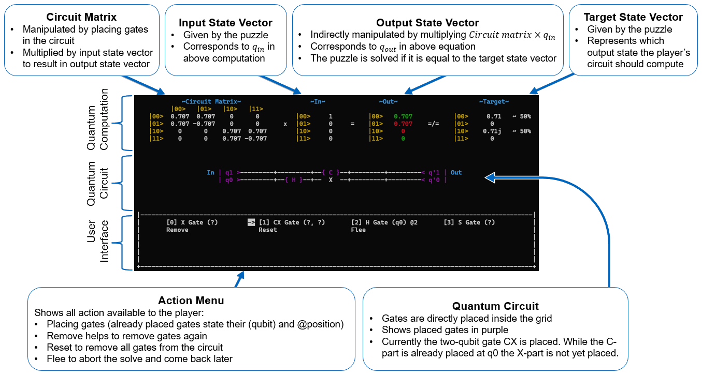
  <figcaption style="text-align: center;">Figure 2: Screenshot of QRogue's puzzle screen with descriptions of what you can see.</figcaption>
</figure>


## Feedback ##
We'd be very happy if you share any feedback with us, regardless whether you liked the game or not.
Just send it via email to qrogue.game@gmail.com with the subject "QRogue Feedback". 
It would also be nice if you could add your user-data folder ("qrogue/QrogueData", for standard installations it can be found in your virtual environment's packages) with the log files. Thanks!


## Installation ##

### Dependencies ###
- py_cui 0.1.4
- qiskit 0.34.2
- numpy 1.20.3
- antlr4-python3-runtime 4.10

However, these dependencies are installed automatically if you install QRogue via pip.

### Linux/macOS ###

#### Prerequisites ####

- Python 3.8
- pip

For Linux/macOS, you simply have to run 
```bash
pip install qrogue
```
to install QRogue in your current Python environment. 

Afterwards you can launch the game simply by executing `qrogue` in the Python environment you installed QRogue in.

### Windows ###

Alternatively, you can download a Windows-build from <a href="https://github.com/7Magic7Mike7/Qrogue/releases">here</a> and simply launch qrogue.exe.

#### Prerequisites ####

Same as for Linux/macOS


### Notes ###

- `py_cui.errors.PyCUIOutOfBoundsError` 

Should you ever encounter this error
when starting the game, please try to maximize the console you 
use for playing. This is because currently there is no automatic 
font size adaption, so depending on your console settings a 
minimum width and height is required. Alternatively, or if 
maximizing doesn't help, you can also lower the font size of the 
console.

- newer Python versions

Usually also Python 3.9 should perfectly work for 
playing QRogue, but testing is currently done for Python 3.8, so 
there is no official support yet for other versions. The same 
is true if you decide to manually install the dependencies; newer 
version will likely work, but are not recommended.
Python 3.10 is not yet supported due to changes in import locations.


## Playing the Game ##

### Terminal ###

While the game can be played on any terminal, we developed the game while playing on <a href="https://www.microsoft.com/store/productId/9N0DX20HK701?ocid=pdpshare">Windows Terminal</a> with the following settings (should be mostly applicable to other terminals as well):

- Font  
Font face and font size are most important and should be available in all terminals. Don't worry if you cannot adjust font weight or line height.
  - Font Face = Cascadia Mono  
  Use a monotype font face because otherwise the game will not be displayed in a straight grid.
  - Font Size = 13  
  Depends on used font face and screen size (we used 1920x1080, Full HD). In general, this font size allowed us to display 46 rows and 189 characters per row (more details further down or in the game's Screen check-menu).
  - Font Weight = Bold  
  Depends on your specific font face and your preferred look.
  - Line Height = 1.2 (default value)  
  Again, font face dependent.


- Colors  
QRogue uses colors to highlight certain words in explanations, 
objects in the game world or elements of the puzzle screen. 
The following list is what we used, but can freely be adjusted based on your preferences 
(although they should be distinguishable from each other, 
so players have an easy time reading texts, the game world or puzzles - 
more on that further down in Screen Check).
  - "red": "#C50F1F"
  - "brightRed": "#E74856"
  - "green": "#13A10E"
  - "brightGreen": "#16C60C"
  - "blue": "#0037DA"
  - "brightBlue": "#3B78FF"
  - "purple": "#881798"
  - "brightPurple": "#B4009E"
  - "yellow": "#C19C00"
  - "cyan": "#3A96DD"
  - "black": "#0C0C0C" 
  - "brightBlack": "#767676"
  - "white": "#CCCCCC"
  - "brightWhite": "#F2F2F2"
  - "foreground": "#CCCCCC"
  - "background": "#0C0C0C"
  - "cursorColor": "#FFFFFF"


### Launch Options ###

* `--user-data` / `-ud $path`:  
Path to the folder where you want to store/load user data (options, save data) from. By default, QRogue will create a new folder in its installation directory.

* `--game-data` / `-gd $path`:  
Path to the folder where you want to store/load game data (levels, default config, clean  save) from. Only specify if you know what you're doing!


For debugging purposes only:

* `--debug` / `-d`:  
  Activates debug-mode and certain options like additional logs, rendering additional information, cheat codes, simulation of runs, ...

* `--from-console` / `-fc`:  
  Skips the closing prompt when you exit the game. Necessary to see errors if you're not starting the game from a console.

* `--validate-map` / `-vm $path`:  
  Check whether a level can be generated successfully from the given `.qrdg` file.

* `--test-level` / `-tl $path`:  
  Specifies a level to play.

* `--simulation-path` / `-sp $path`:  
  Specifies the `.qrkl` (key log) file to use for simulating a run of the game.


### Controls ###
- Navigate in menus: Arrow Keys, wasd
- Move in game world: Arrow Keys, wasd
- Scroll in popup: Arrow Keys, wasd
- Close popup: Space, Enter
- Reopen last popup: H
- Select answer in question popup: horizontal Arrow Keys, ad
- Confirm selection (also in question popup): Space, Enter
- Cancel/back: Shift+A, Shift+Left, Backspace
- Pause: P, Tab
- Situational 
  - shortcut keys: 0-9
  - 
- Debug Keys (not for use in standard play through!)
  - Print screen: CTRL+P
  - Force re-render: CTRL+R 


### Difficulty Modes ###

The first time you launch the game, you will be asked to choose a difficulty:

* Quantum Newbie:  
The training program will use easier puzzles and explain both game mechanics and Quantum Computing in full detail. Pick this difficulty if you are unsure.

* Quantum Experienced:  
The training program will use harder puzzles and only explain game mechanics. Explanations about Quantum Computing can still be read via the in-game manual.

The game does not support adjusting the difficulty. Because after completing the training program (45-60min), both modes behave the exact same way.

### Main Menu ###

On a fresh save, the main menu will have the following options:

- `START YOUR JOURNEY`  
Starts the training program. Changes to `CONTINUE` after completing the first lesson of the training program.

- `SCREEN CHECK`  
See section below for more info.

- `SAVE`  
Saves the game.

- `EXIT`  
Exit the game.

As you progress through the training program, you will unlock the following two options:

- `LEVEL SELECT`  
Replay completed Lessons or start specific Expeditions, with the option to choose which Quantum Gates you want to bring with you

- `WORKBENCH`  
Manage your Quantum Gates to combine them into new, more complex ones.


### Screen Check ###

Since QRogue is played in a terminal, it cannot control its exact look. Hence, it is recommended to quickly verify with the screen check-menu if the used colors are distinguishable (see previous Section Terminal→Colors) and, most importantly, your window is big enough. The minimum required window dimensions (referring to the number of rows and the number of characters per row) and the actual window dimensions can be found in the top right.

The texts in the screen check-menu already explain what you should see and be able to distinguish, but here are some screenshots for reference:

<figure id="sc_level-fig">
<p align="center">
  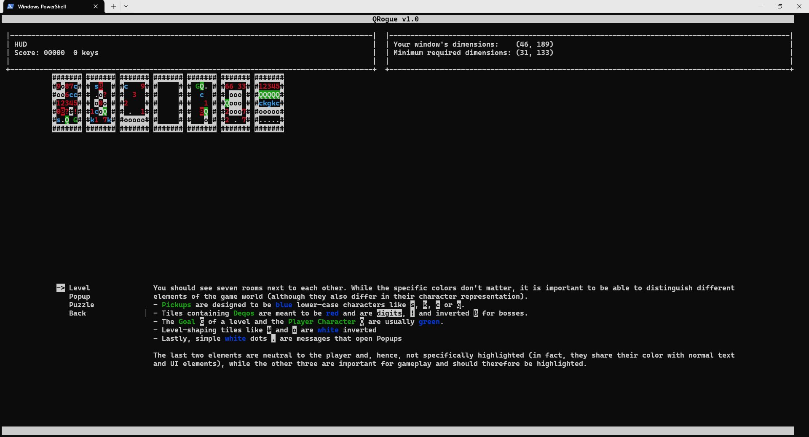Figure 3: Screen check showcasing the different parts of a level and their different colors.</figcaption>
</p>
</figure>
<figure id="sc_popup1-fig">
<p align="center">
  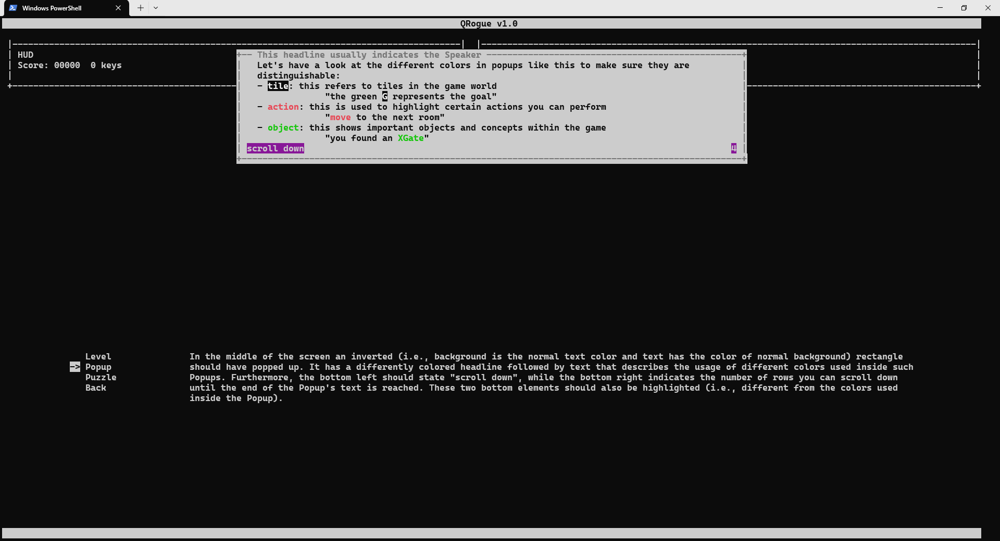Figure 4: Top-right = Screen check showcasing the colors used in a popup (1).</figcaption>
</p>
</figure>
<figure id="sc_popup2-fig">
<p align="center">
  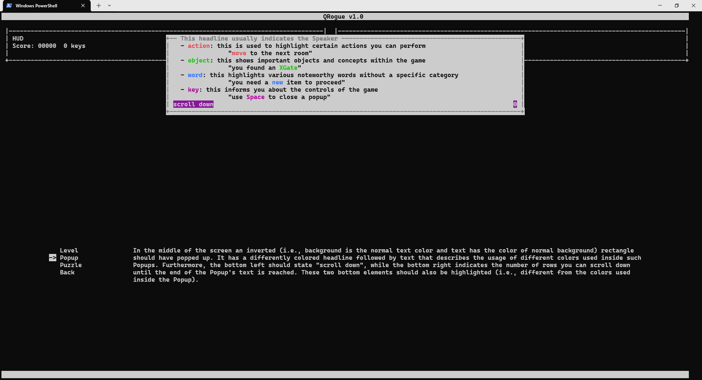Figure 5: Screen check showcasing the colors used in a popup (2).</figcaption>
</p>
</figure>
<figure id="sc_puzzle1-fig">
<p align="center">
  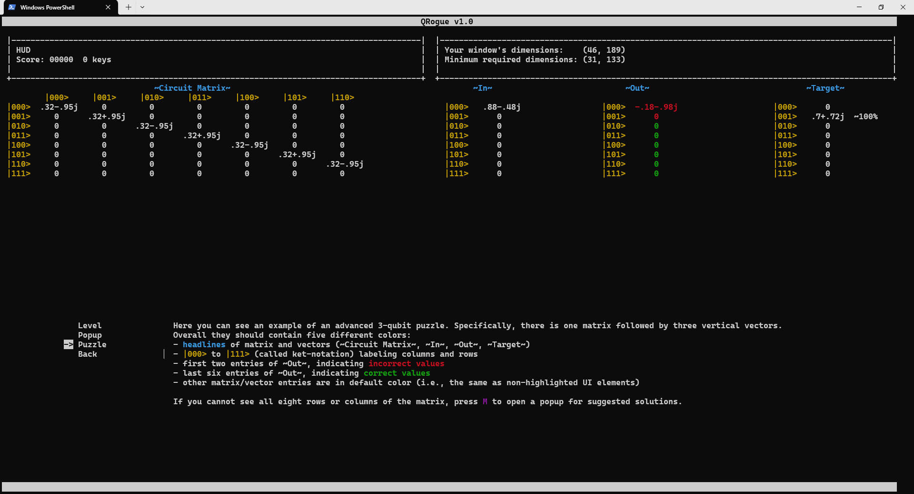Figure 6: Screen check showcasing the colors used in a quantum puzzle (not enough space for whole matrix).</figcaption>
</p>
</figure>
<figure id="sc_puzzle2-fig">
<p align="center">
  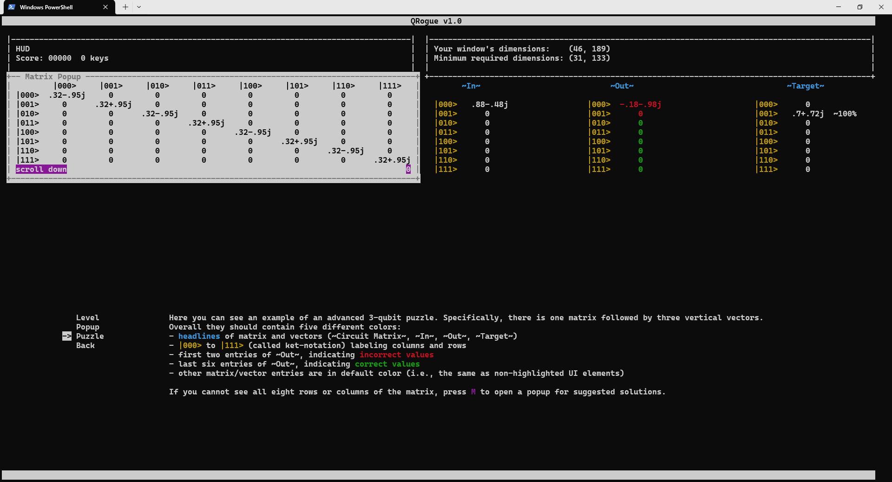Figure 7: Screen check showcasing the matrix popup.</figcaption>
</p>
</figure>
<figure id="sc_dimmerror-fig">
<p align="center">
  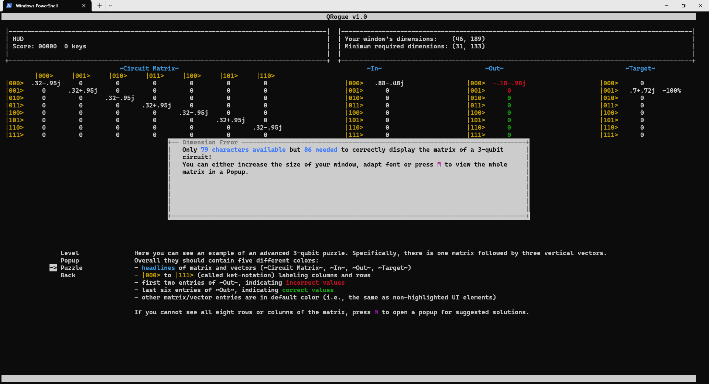Figure 8: Screen check showcasing a popup describing the actually available versus required space to display the whole matrix.</figcaption>
</p>
</figure>


### Pause Menu ###

You can do several things in the Pause Menu:

- `Continue`  
Continue from where you opened the Pause Menu.
- `Restart`  
Re-randomizes puzzles and restarts the current level.
- `Save`  
Saves the game (only if progress changes since the last save).
- `Manual`  
An encyclopedia of all things important to play the game.
- `Options`  
Tweak some options to your liking.
- `Exit`  
Exit the current level and go back to the Main Menu.


## Mathematical background ##

Quantum computations are the heart of _QRogue's_ puzzles. They boil down to matrix-vector multiplication, whereas states (e.g., input or output state) are described by vectors and operations (i.e., gates) by matrices. To get a glimpse of what this means, we will describe the basics in the following sections.


### Quantum Bits ###

Unlike classical (i.e., electrical) bits, quantum bits can not only be $0$ or $1$ but rather a linear combination of these two classical states.
By writing them in _ket-notation_ (${|0>}$ and ${|1>}$, respectively) defined as
```math
	{|0>} = \begin{pmatrix} 1\\0\end{pmatrix}
	,  
	{|1>} = \begin{pmatrix} 0\\1\end{pmatrix}
```
we can introduce so-called amplitudes $\alpha, \beta \in \mathbb{C}$, with ${|\alpha|}^2 + {|\beta|}^2 = 1$ to fully describe the state of any qubit $q_i$ as follows:
```math
	q_i = \alpha {|0>} + \beta {|1>} = \begin{pmatrix} \alpha\\0\end{pmatrix} + \begin{pmatrix} 0\\\beta\end{pmatrix} = \begin{pmatrix} \alpha\\\beta\end{pmatrix}.
```
In case $\alpha \ne 0$ and $\beta \ne 0$ the qubit is in _superposition_ (i.e., a non-classical state where the qubit is both $0$ and $1$ at the same time) whereas $\alpha = 1$ or $\beta = 1$ correspond to the classical states $0$ or $1$, respectively.


### Quantum Operations ###

To conduct computations on qubits _QRogue_ uses quantum gates corresponding to certain quantum operations. All of them can be described by $2^n \times 2^n$ unitary matrices, with $n$ corresponding to the number of qubits the operation is applied to (e.g., single qubit operations have dimensions $2 \times 2$).

Let's take a look at a counterpart to the classical _NOT_ operation (i.e., _not_ $0 = 1$ and _not_ $1 = 0$):
```math
	X =
	\begin{bmatrix}
	0 & 1 \\
	1 & 0
	\end{bmatrix} .
```
The effect of applying this operation onto a single qubit $q_0$ can be calculated by matrix-vector multiplication:
```math
	{q{'}_{0}} = Gate \times {q_0} = X \times (\alpha{|0>} + \beta{|1>}) = 
	\begin{bmatrix}
	0 & 1 \\
	1 & 0
	\end{bmatrix} 
	\begin{pmatrix} \alpha\\\beta \end{pmatrix}
	=
	\begin{pmatrix} \beta\\\alpha \end{pmatrix}.
```
If $q_0$ is in a classical state (e.g., either $\alpha = 1$ or $\beta = 1$) we can easily see that this indeed corresponds to a _NOT_.

For a second example we consider the _Hadamard_ operation $H$ which is often used to create _superposition_:
```math
	H =
	\frac{1}{\sqrt{2}}\begin{bmatrix}
	1 & 1 \\
	1 & -1
	\end{bmatrix} .
```
Now we assume our qubit $q_0$ is in the classical zero state ${|0>}$ (i.e., $\alpha = 1$ and $\beta = 0$) and we apply the _Hadamard_ operation onto it:
```math
	{q{'}_{0}} = H \times {|0>} = 
	\frac{1}{\sqrt{2}}\begin{bmatrix}
	1 & 1 \\
	1 & -1
	\end{bmatrix} 
	\begin{pmatrix} 1\\0\end{pmatrix}
	=
	\frac{1}{\sqrt{2}}\begin{pmatrix} 1\\1\end{pmatrix}.
```
As we can see, ${q{'}_{0}}$ is now in _superposition_ and $\alpha = \beta = \frac{1}{\sqrt{2}}$.  
In _QRogue_ the last example would correspond to an _H Gate_ being placed on $q_0$ in our quantum circuit like this: <br>
<p align="center">
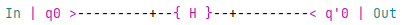
</p>


<!-- sequential gates -->
### Applying Operations in series ###

Since we usually want to conduct more than a single operation, we can combine sequentially applied operations by matrix-matrix multiplication:
```math
	algorithm_{xh} = H \times X = 
	\frac{1}{\sqrt{2}}\begin{bmatrix}
	1 & 1 \\
	1 & -1
	\end{bmatrix} 
	\begin{bmatrix}
	0 & 1 \\
	1 & 0
	\end{bmatrix} 
	=
	\frac{1}{\sqrt{2}}\begin{bmatrix}
	1 & 1 \\
	-1 & 1
	\end{bmatrix}
```

Again, these two operations can be applied onto the state ${|0>}$:
```math
	{q{'}_{0}} = H \times X \times {|0>} = algorithm_{xh} \times {|0>} =
	\frac{1}{\sqrt{2}}\begin{bmatrix}
	1 & 1 \\
	-1 & 1
	\end{bmatrix} 
	\begin{pmatrix} 1\\0\end{pmatrix}
	=
	\frac{1}{\sqrt{2}}\begin{pmatrix} 1\\-1\end{pmatrix}.
```

This algorithm is equivalent to the following circuit in _QRogue_:  
<p align="center">
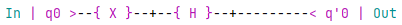
</p>

Note that the order of $X$ and $H$ is from left to right in the circuit, while it is from right to left in the multiplication. This is also the reason we denoted it as $algorithm_{xh}$ and not $algorithm_{hx}$.


### Working with multiple Qubits ###

To work with more than a single qubit we first need to extend our state vector. This is done by computing the _Kronecker product_ of two single qubit states:
```math
	q_{in} = q_1 \otimes q_0 = \begin{pmatrix} \alpha_1\\\beta_1 \end{pmatrix} \otimes \begin{pmatrix} \alpha_0\\\beta_0 \end{pmatrix} =
	\begin{pmatrix} \alpha_1 \times \alpha_0\\ \alpha_1 \times \beta_0 \\ \beta_1 \times \alpha_0 \\ \beta_1 \times \beta_0 \end{pmatrix}.
```
Alternatively, this can be also written as 
$q_{in} = (\alpha_1 \times \alpha_0){|00>} + (\alpha_1 \times \beta_0){|01>} + (\beta_1 \times \alpha_0){|10>} + (\beta_1 \times \beta_0){|11>}$.

In case of $q_0 = q_1 = {|0>}$ this results in
```math
	q_{in} = q_1 \otimes q_0 = \begin{pmatrix} 1\\ 0\end{pmatrix} \otimes \begin{pmatrix} 1\\ 0\end{pmatrix} =
	\begin{pmatrix} 1\\ 0\\ 0\\ 0\end{pmatrix},
```
corresponding to the classical state ${|00>}$.

To conduct single qubit operations on our two qubit state, we also need to extend the operations via _Kronecker products_. Luckily, the identity operation $I$ can help us out to apply an operation to a qubit without changing its state. As an example, we apply $H$ onto $q_0$ without influencing $q_1$:
```math
	{q_{out}} = {q{'}_{in}} = (I \otimes H) \times (q_1 \otimes q_0) = 
	(
		\begin{bmatrix}
		1 & 0 \\
		0 & 1
		\end{bmatrix} 
		\otimes
		\frac{1}{\sqrt{2}}\begin{bmatrix}
		1 & 1 \\
		-1 & 1
		\end{bmatrix} 
	) \times q_{in}
```
```math
	= \frac{1}{\sqrt{2}}
	\begin{bmatrix}
		1 & 1 & 0 & 0 \\
		1 & -1 & 0 & 0 \\
		0 & 0 & 1 & 1 \\
		0 & 0 & 1 & -1
	\end{bmatrix} 
	\times \begin{pmatrix} 1\\ 0\\ 0\\ 0\end{pmatrix} =
	\frac{1}{\sqrt{2}} \begin{pmatrix} 1\\ 1\\ 0\\ 0\end{pmatrix}
```
Or alternatively ${q{'}_{in}} = \frac{1}{\sqrt{2}} ({|00>} + {|01>})$ where ${|00>}$ is the combination of states $q_1 = {|0>}, q_0 = {|0>}$ and ${|01>}$ the combination of $q_1 = {|0>}, q_0 = {|1>}$.

This algorithm is equivalent to the following circuit in _QRogue_:  
<p align="center">
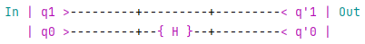
</p>


<!-- parallel gates -->
### Applying Operations in parallel ###

Just like we previously extended $H$ with $I$ to be able to apply it to a two qubit state, we can also extend $H$ by another operation. This corresponds to applying these two operations in parallel. When applying $H$ onto $q_0$ and $X$ onto $q_1$, this looks as follows:
```math
	algorithm_{hx} = \begin{bmatrix}
		0 & 1 \\
		1 & 0
		\end{bmatrix} 
		\otimes
		\frac{1}{\sqrt{2}}\begin{bmatrix}
		1 & 1 \\
		-1 & 1
		\end{bmatrix} 
	= \frac{1}{\sqrt{2}}
	\begin{bmatrix}
		0 & 0 & 1 & 1 \\
		0 & 0 & 1 & -1 \\
		1 & 1 & 0 & 0 \\
		1 & -1 & 0 & 0
	\end{bmatrix} 
```
Once again, this algorithm corresponds to the following circuit in _QRogue_:  
<p align="center">
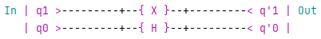
</p>

Which is also equivalent to:  
<p align="center">
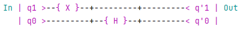
</p>


## References ##

* <a href="https://www.cda.cit.tum.de/app/qrogue/">Website</a>  

* <a href="https://www.cda.cit.tum.de/files/eda/2023_fdg2023_qrouge_teaching_quantum_computing_using_rogue-like_game_concept.pdf">Short Paper</a>  
Presented at <a href="https://fdg2023.org/">FDG2023</a> conference 
* <a href="https://pypi.org/project/qrogue/">PyPI</a>  
Python packages for installation via pip
