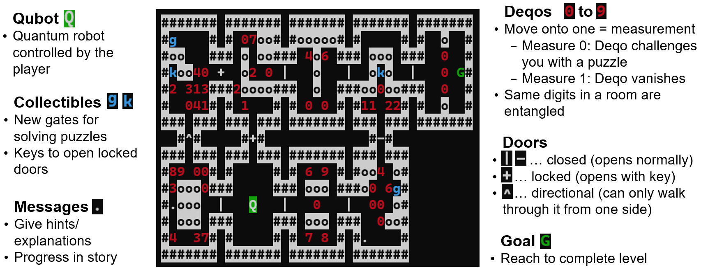

# QRogue v0.8 #


## A journey through a universe full of Quantum Computing!

QRogue is an educational game about Quantum Computing, inspired in look and feel by the 1980's released classical game <a href="https://en.wikipedia.org/wiki/Rogue_%28video_game%29">Rogue</a>. You will play as a student who's dreaming about traveling the galaxy. As you hear about "Mission Quniverse", you immediately apply for its training program to be able to join this fascinating Quantum Computing powered universe exploration mission. In the lessons of the training program and later on during expeditions of Mission Quniverse you will come across a variaty of Quantum Gates to steadily increase the capabilities of your *Qubot* - a robot you control to manipulate Quantum Circuits - and even design small scale Quantum Algorithms.

But beware of ill-disposed Decoherers - or *Deqos* for short! They got their name from Decoherence, a phenomenon of the Quantum realm that describes how interactions with the environment can destroy a quantum state and turn it classical. And these Deqos will do their best to stand in your way. But luckily, they are in *Superposition* and your Qubot is equipped with a *Measurement* ability. This means, you can collapse their Quantum state to 0 or 1 by moving towards them. Depending on the result, they will either manifest and block your path until you solve their Quantum Puzzle or vanish without a trace.
Be ready to combine various Quantum Gates into all kinds of Quantum Circuits should you be challenged to solve a Puzzle. And some Deqos will be *entangled*, forming a group that collectively collapses to the same classical state upon Measurement. 
 
 <figure id="qrogue_lvl-fig">
  
  <figcaption style="text-align: center;">Figure 1: Examplatory level of QRogue with descriptions of what you can see in a typical level.</figcaption>
</figure>


## Table of Contents ##
- Feedback
- Installation
  - Dependencies
  - Linux
  - Windows
  - Notes
- Starting the game
  - Launch Options
  - Screen check
- How to play - Controls
- References


## Feedback ##
We'd be very happy if you share any feedback with us, regardless whether you liked the game or not.
Just send it via Email to qrogue.game@gmail.com with the subject "QRogue Feedback". 
It would also be nice if you could add your user-data folder ("qrogue/QrogueData", for standard installations it can be found in your virtual environment's packages) with the log files. Thanks!


## Installation ##

### Dependencies ###
- py_cui 0.1.4
- qiskit 0.34.2
- numpy 1.20.3
- antlr4-python3-runtime 4.10

However, these dependencies are installed automatically if you install QRogue via pip.

### Linux/macOS ###

#### Prerequisites ####

- Python 3.8
- pip

For Linux/macOS you simply have to run 
```bash
pip install qrogue
```
to install QRogue in your current Python environment. 

Afterwards you can launch the game simply by executing `qrogue` in the Python environment you installed QRogue in.

### Windows ###

#### Prerequisites ####

Same as for Linux/macOS


### Notes ###

- `py_cui.errors.PyCUIOutOfBoundsError` 

Should you ever encounter this error
when starting the game please try to maximize the console you 
use for playing. This is because currently there is no automatic 
font size adaption so depending on your console settings a 
minimum width and height is required. Alternatively or if 
maximizing doesn't help you can also lower the font size of the 
console.

- newer Python versions

Usually also Python 3.9 should perfectly work for 
playing QRogue but testing is currently done for Python 3.8 so 
there is no official support yet for other versions. The same 
is true if you decide to manually install the dependencies; newer 
version will likely work but are not recommended.
Python 3.10 is not yet supported due to changes in import locations.


## Starting the Game ##

### Launch Options ###

* `--user-data` / `-ud $path`:  
Path to the folder where you want to store/load user data (options, save data) from. By default, QRogue will create a new folder in its installation directory.

* `--game-data` / `-gd $path`:  
Path to the folder where you want to store/load game data (levels, default config, clean  save) from. Only specify if you know what you're doing!


For debugging purposes only:

* `--debug` / `-d`:  
  Activates debug-mode and certain options like additional logs, rendering additional information, cheat codes, simulation of runs, ...

* `--from-console` / `-fc`:  
  Skips the closing prompt when you exit the game. Necessary to see errors if you're not starting the game from a console.

* `--validate-map` / `-vm $path`:  
  Check whether a level can be generated successfully from the given `.qrdg` file.

* `--test-level` / `-tl $path`:  
  Specifies a level to play.

* `--simulation-path` / `-sp $path`:  
  Specifies the `.qrkl` (key log) file to use for simulating a run of the game.


### Difficulty modes ###

The first time you launch the game you will be asked to choose a difficulty:

* Quantum Newbie:  
The training program will use easier puzzles and explain both game mechanics and Quantumg Computing in full detail. Pick this difficulty if you are unsure.

* Quantum Experienced:  
The training program will use harder puzzles and only explain game mechanics. Explanations about Quantum Computing can still be read via the in-game manual.

The game does not support adjusting the difficulty. Because after completing the training program (45-60min), both modes behave the exact same way.

### Main Menu ###

On a fresh save, the main menu will have the following options:

- `START YOUR JOURNEY`  
Starts the training program. Changes to `CONTINUE` after completing the first lesson of the training program.

- `SCREEN CHECK`  
See section below for more info.

- `SAVE`  
Saves the game.

- `EXIT`  
Exit the game.

As you progress through the training program, you will unlock the following two options:

- `LEVEL SELECT`  
Replay completed Lessons or start specific Expeditions, with the option to choose which Quantum Gates you want to bring with you

- `WORKBENCH`  
Manage your Quantum Gates to combine them into new, more complex ones.


### Screen check ###
Since QRogue is played in a terminal, it cannot control its exact look. Hence, it is recommend to quickly check out the screen check-menu to check if the used colors are distinguishable and, most importantly, your window is big enough compared to the font size. The minimum required window dimensions compared with the actual window dimensions can be found in the top right.


# todo: example images for screen check to *see* how the colors should differ

## How to play - Controls ##
- Navigate in menus: Arrow Keys, wasd
- Move in game world: Arrow Keys, wasd
- Scroll in popup: Arrow Keys, wasd
- Close popup: Space, Enter
- Reopen last popup: H
- Select answer in question popup: horizontal Arrow Keys, ad
- Confirm selection (also in question popup): Space, Enter
- Cancel/back: Shift+A, Shift+Left, Backspace
- Pause: P, Tab
- Situational 
  - shortcut keys: 0-9
  - 
- Debug Keys (not for use in standard play through!)
  - Print screen: CTRL+P
  - Force re-render: CTRL+R 


## References ##

* <a href="https://www.cda.cit.tum.de/app/qrogue/">Website</a>  

* <a href="https://www.cda.cit.tum.de/files/eda/2023_fdg2023_qrouge_teaching_quantum_computing_using_rogue-like_game_concept.pdf">Short Paper</a>  
Presented at <a href="https://fdg2023.org/">FDG2023</a> conference 
* <a href="https://pypi.org/project/qrogue/">PyPI</a>  
Python packages for installation via pip
